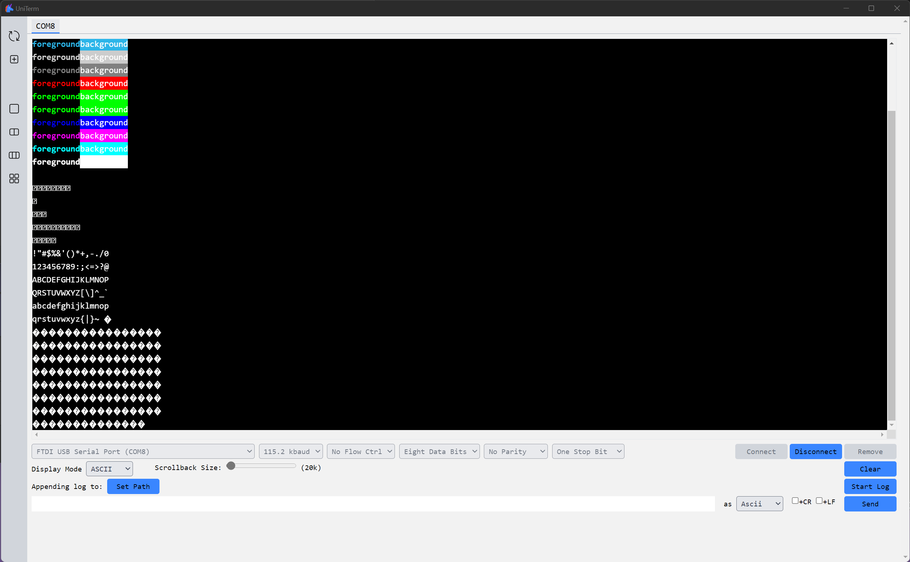
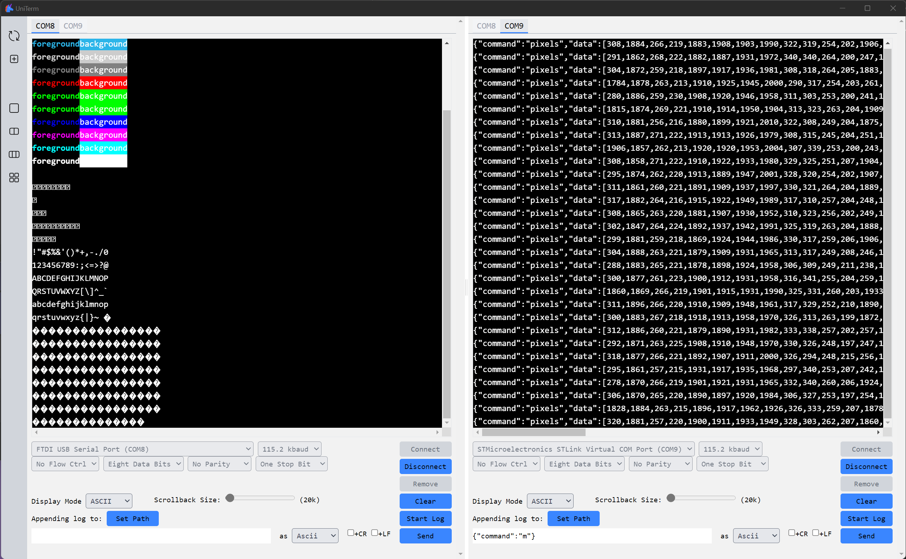
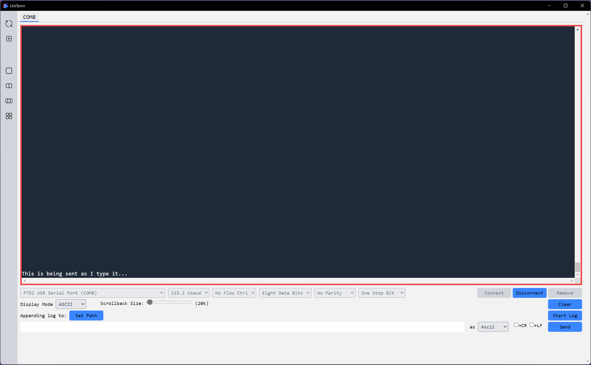

# UniTerm - Serial port terminal

 

## Features

* Split view - see multiple terminals at once
* Display received data as
    * ASCII text
    * ANSI colored text
    * Decimal values
    * Hex values
* Send data as
    * ASCII text
    * Decimals values
    * Hex values
* Send real time Ascii text data by clicking in the terminal display before typing
* Log received data to file
* Manage multiple port connections

## Screenshots







## Install

Download the latest install or stand alone version from [releases](https://github.com/aero530/uniterm/releases).  Note that the installer seems to hang for a while before it brings up the User Account Control popup in Windows.  This is normal.  If you wait it should work fine...just takes some time.


## Roadmap

* History of text/bytes sent - Keep history of last 10 or so list of bytes sent from the bottom text input box and have a drop down menu to allow a user to select from the previous list.
* Improve ANSI support - Currently only properly supports forground / background color escapes.  Could use something like https://crates.io/crates/vte or https://crates.io/crates/vtparse 

## Development

### Setup

1. Follow guild to [install prereq for Tauri](https://tauri.app/v1/guides/getting-started/prerequisites). Make sure not to miss the first step of [installing Rust](https://rustup.rs).
2. Clone this repo
3. Install npm requirements
    ```bash
    > npm install
    ```
4. Run in dev mode
    ```bash
    > cargo tauri dev
    ```
5. Build release files
    ```bash
    > cargo tauri build
    ```

### Update Tauri-cli

Occationally messages will pop up when running the dev compiler that say there is a new version of Tauri-cli.  This command line snip will update the Tauri-cli toolchain.

```bash
> cargo install tauri-cli
```

### Generating icon files

Tauri will convert an svg image to all the icon files needed and put them in the correct folder for you.

```bash
> npx @tauri-apps/tauricon icon.svg
```