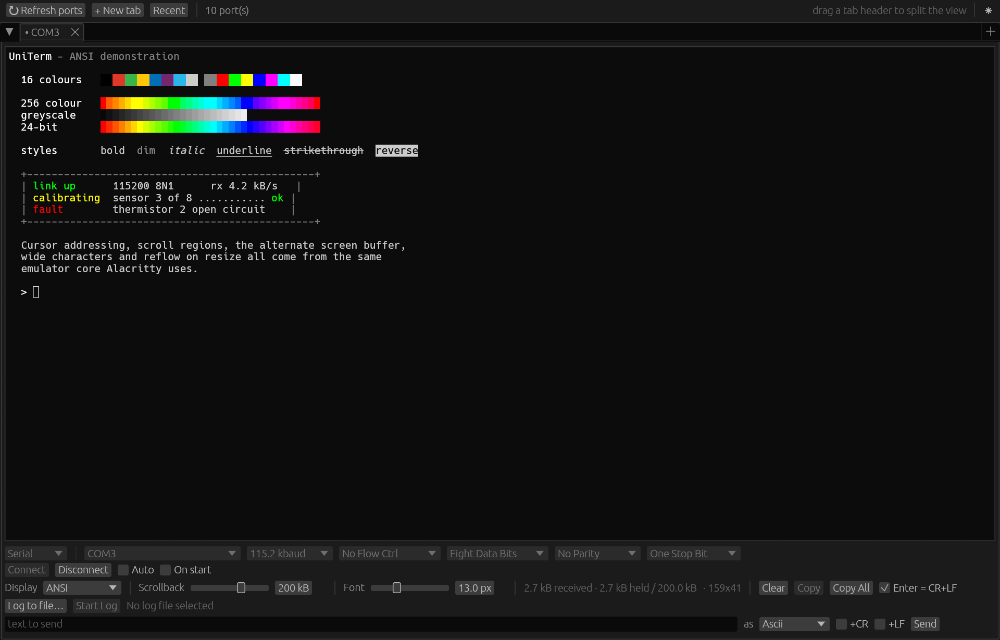
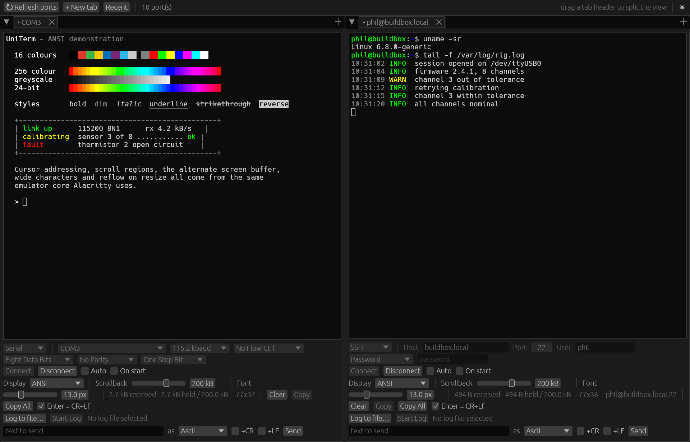
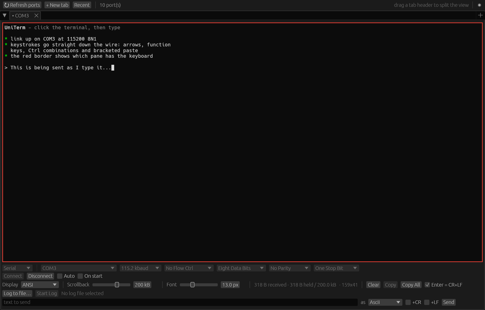

# UniTerm - Serial port terminal


A native serial terminal built with [egui](https://github.com/emilk/egui) and
[egui_dock](https://github.com/anhosh/egui_dock).

## Features

* Dockable, splittable views — drag a tab header to split; drag tabs between panes or out
  into their own window
* **Serial and SSH** in the same window, a tab at a time. SSH gets a real PTY, password or
  private-key authentication, and window-resize notification so full-screen programs reflow
  when you resize the pane.
* **Host keys are verified** against `~/.ssh/known_hosts`, interoperating with OpenSSH. An
  unrecognised host shows its fingerprint and is only trusted if you say so; a host key that
  has *changed* is refused outright, because that is what interception looks like.
* **Reconnect without losing the terminal.** When a connection drops, one button
  re-establishes it; everything already on screen stays, and a divider marks where the new
  session begins. Optional automatic retry backs off between attempts. A replugged USB serial
  adapter is followed to whatever port number the OS gives it next.
* **Your layout and tabs come back.** Closing the window saves the dock layout and every tab's
  settings; the next start restores them. Tabs come back defined but *not* connected unless you
  tick "On start" for that tab — and even then only when the saved device is really the one
  attached.
* **Recent connections.** Anything that has connected successfully is remembered and reopens in
  one click, from the toolbar menu or from the panel shown when no tabs are open. Entries can be
  pinned so they are kept and listed first, forgotten individually, or cleared.
* **Full terminal emulation** in ANSI mode, built on
  [`alacritty_terminal`](https://crates.io/crates/alacritty_terminal) — the same core
  Alacritty ships. Cursor addressing, erase, scroll regions, the alternate screen buffer,
  wide characters, reflow on resize, and base / bright / 256-colour / 24-bit colour, plus
  bold, dim, italic, underline, strikethrough and reverse video.
* **Light and dark themes**, applied to the whole window including the terminal screen. The
  sixteen ANSI colours are deliberately *not* re-themed — a program asking for slot 7 means
  white, and a status bar drawn as white-background/black-text has to keep working — so
  instead each cell's text is checked against the background it actually landed on and nudged
  only if it would be invisible. That fixes black text on the dark theme too, which used to
  disappear entirely.
* Display received data as
  * ANSI — a real terminal screen
  * ASCII text — the raw view, with control bytes shown as caret notation (`^[`, `^C`, `^?`)
  * Decimal values
  * Hex values
* Send data as ASCII text, decimal values or hex values, with optional CR / LF
* Type directly into the terminal to transmit in real time: arrow keys, function keys,
  control combinations (Ctrl+C sends `0x03`), application-cursor-key mode and bracketed
  paste. A terminal takes the keyboard when you click it, or as soon as it connects, and
  shows a red border while it has it — so you can see where your typing is going. Tab, the
  arrows and Escape go to the remote end rather than moving between controls.
* Select with the mouse and copy (Ctrl+Shift+C); Alt-drag for a rectangular selection
* Scroll back through history with the wheel, Shift+PageUp/PageDown, or the indicator on the
  right edge
* The terminal resizes with the pane, and answers terminal queries (device attributes,
  cursor position) so programs that ask do not hang
* Log received data to file
* Manage multiple port connections
* Notices an unplugged adapter and reports why a connection dropped

## Screenshots

A real terminal screen: the sixteen ANSI colours, the 256-colour cube, the greyscale ramp,
24-bit colour, and every text attribute the emulator supports.



Serial and SSH side by side. Drag a tab header to split the view; each pane keeps its own
connection settings, display mode and scrollback.



Click a terminal and type — keystrokes go straight down the wire. The red border shows which
pane holds the keyboard.



## Install

### Windows

Download the `.msi` from [releases](https://github.com/aero530/uniterm/releases) and run it.

It installs **for the current user only**, into `%LOCALAPPDATA%\Programs\UniTerm`, so there is
**no UAC prompt** — nothing about a serial terminal needs administrative rights. Uninstall from
Settings > Apps like any other application.

To install without the wizard:

```powershell
msiexec /i UniTerm-3.0.0-x64.msi /qn
```

> **Upgrading from 1.x?** The Tauri-era 1.x installer was per-machine and is a different product
> as far as Windows Installer is concerned, so this package will not replace it — you would end up
> with both and two Start Menu entries. Uninstall the old UniTerm first.

### Linux

Download the `.snap` from [releases](https://github.com/aero530/uniterm/releases):

```bash
sudo snap install --dangerous ./uniterm_3.0.0-dev_amd64.snap
sudo snap connect uniterm:serial-port
sudo snap connect uniterm:hardware-observe
```

`--dangerous` is needed only because the release snaps are not signed by the store.

**Both `snap connect` lines matter.** A snap gets no access to serial devices at all until
`serial-port` is connected, and without `hardware-observe` ports appear with no product or
serial number — which is also what lets a replugged USB adapter be followed to its new port
number. Neither can be connected automatically: `serial-port` is a hardware interface, and
auto-connection is a permission granted per-snap by the store.

If a USB adapter still does not appear after connecting, snapd has to be told to create slots
for hotplugged devices:

```bash
sudo snap set system experimental.hotplug=true
sudo systemctl restart snapd
sudo snap connect uniterm:serial-port
```

Built-in (non-USB) ports such as `/dev/ttyS0` are provided by the gadget on Ubuntu Core and are
not available to a snap on a classic desktop at all. Run from source if you need those.

## Roadmap

The six features planned in [PLAN.md](PLAN.md) are all built. What is left from that work:

* ssh-agent authentication, and optional credential storage in the OS keychain
* An embedded font covering CJK and emoji
* A signed installer (the MSI builds, but releases are unsigned)
* macOS packaging — there is a Windows MSI and a Linux snap, but nothing for macOS

### Current limitations

* **CJK and emoji render as placeholder boxes.** The cell layout is correct — a wide
  character correctly reserves two columns, so surrounding text stays aligned — but egui's
  built-in monospace font has no glyphs for them. Fixing this means embedding a font that
  covers the ranges you need, at a cost in binary size.
* **The byte-oriented views do not soft wrap.** In ASCII, decimal and hex mode long lines
  scroll horizontally, because uniform row height is what lets the scrollback virtualize
  exactly. ANSI mode wraps properly, at the column boundary, because the emulator does it.
* **Selection is ANSI-mode only.** The ASCII, decimal and hex views allow selection within a
  row; use *Copy All* there.
* **ANSI mode holds the scrollback twice** — once as raw bytes, once as the emulator's grid.
  The raw ring has to exist so that switching display modes can replay it, and the two count
  scrollback in different units (bytes vs lines), so the line limit is derived from the byte
  budget as an estimate.
* **Passwords and key passphrases are never written to disk.** They live in memory for the
  life of the process, which is what lets a reconnect re-authenticate without asking again —
  and means a restart does ask. Persisting them is only acceptable via the OS keychain, which
  is not built yet.
* **Reconnect divider timestamps are UTC.** `std` cannot convert to local time, and a date
  library for one line was not worth it, so the zone is labelled rather than guessed.
* **Automatic retry only applies once a connection has worked.** Retrying something that
  never connected just repeats a configuration error, so the first attempt is always manual.
* **Scrollback contents are not saved.** Terminal output routinely contains secrets and can be
  megabytes; only tab definitions and layout are written.
* **State is written on close and every 10 seconds.** A crash or a kill loses changes since the
  last autosave, because `eframe` cannot be asked to save on demand.
* **The snap keeps its own `known_hosts`.** A strict snap cannot read `~/.ssh` — the `home`
  interface excludes hidden directories by design, and the read-only `ssh-keys` interface could
  not record a newly trusted host even if it were connected. The snap therefore uses
  `~/snap/uniterm/common/known_hosts`, so a host trusted in UniTerm is *not* trusted by `ssh`
  and vice versa. Set `UNITERM_KNOWN_HOSTS` to point somewhere else. Outside the snap the
  standard `~/.ssh/known_hosts` is used and does interoperate.
* **The snap cannot see built-in serial ports.** `serial-port` covers USB adapters via snapd's
  hotplug support; `/dev/ttyS0`-style ports are only offered by a gadget snap on Ubuntu Core.
* **ssh-agent is not supported.** It needs a named-pipe transport on Windows and a separate
  code path; a half-working option would be worse than none.
* **A server that refuses a PTY yields a line-mode shell rather than an error.** russh does
  not block for the PTY reply, so the refusal arrives too late to report.
* **The interface can only use glyphs egui's bundled font has.** Tab titles, buttons and
  warnings are limited to what the built-in proportional face covers, which is narrower than
  it looks — U+25CF, U+25BE and U+26A0 are all absent, and using one renders a hollow box.
  A test pins the set in use; embedding a font would lift the restriction.

### Where state is stored

`%APPDATA%\UniTerm\data\app.ron` on Windows (`~/.local/share/uniterm/` on Linux,
`~/Library/Application Support/UniTerm/` on macOS). It is a readable RON file holding the dock
layout, one entry per tab, and the window geometry.

Inside the snap this is redirected to `~/snap/uniterm/current/.local/share/uniterm/`, which
snapd copies forward on refresh, and the host key store sits alongside it in
`~/snap/uniterm/common/`.

If it cannot be read — corrupted, or written by a newer UniTerm — the app starts with a fresh
layout, says so in the toolbar, and keeps the unreadable payload under a separate key rather
than overwriting it. Deleting the file is always safe.

### A note on the SSH crypto backend

`russh` defaults to the `aws-lc-rs` backend, whose `aws-lc-sys` crate is a C library needing
CMake and NASM — it does not build on a stock Windows toolchain. UniTerm selects the `ring`
backend instead, so `cargo build` stays pure cargo with no external build tools. See the
comment in [Cargo.toml](Cargo.toml).

## Development

### Setup

1. Install Rust via [rustup](https://rustup.rs). The build needs Rust 1.85 or newer.
2. Clone this repo.
3. Run it:

  ```bash
  cargo run
  ```

There is no Node toolchain, no web build step and no separate frontend — it is one Rust
crate.

On Windows that is the whole story: no CMake, no NASM, no C toolchain beyond the MSVC linker.
On Linux, serial port enumeration links against libudev, so its headers are needed:

```bash
sudo apt install build-essential pkg-config libudev-dev
```

That is the whole list — verified by building on a clean Ubuntu. No Wayland or X11 `-dev`
packages are needed, because winit and wgpu reach the display stack through `dlopen` rather
than linking against it.

`libudev-dev` is not optional. Without the `libudev` cargo feature — enabled for Linux in
`Cargo.toml` — `serialport` compiles no Linux branch at all and `available_ports` returns
"Not implemented for this OS", so the port list is silently empty.

### Build a release binary

```bash
cargo build --release
```

The executable lands in `target/release/UniTerm` (`.exe` on Windows). It is self-contained:
on Windows the window and taskbar icons are embedded at build time, and on Linux the desktop
entry and icon are supplied by the snap.

### Build the installer

```powershell
.\installer\build.ps1
```

Produces `target/installer/UniTerm-<version>-x64.msi`. Then check it actually works:

```powershell
.\installer\verify.ps1
```

`verify.ps1` installs the MSI, confirms the files, Start Menu shortcut and registration, launches
the installed binary, reinstalls to prove upgrades replace rather than duplicate, then uninstalls
and confirms nothing is left behind. It exits non-zero on the first failure, so it works as a
release gate — [the release workflow](.github/workflows/release.yml) runs it before publishing.

The WiX toolset is provisioned on first use into `target/installer-tools/`: a pinned copy of the
official WiX 3.14 archive, verified against a SHA-256 in `build.ps1`. Nothing is installed
system-wide and no administrator rights are needed. A WiX already on `PATH` or in `$env:WIX` is
used in preference; `-PinnedWix` forces the pinned copy so release builds do not depend on
whatever a build machine happens to have. `-NoDownload` refuses to fetch anything.

Useful flags:

| Flag | Effect |
|---|---|
| `-SkipBuild` | Package `target/release` as-is instead of rebuilding |
| `-Version 3.1.0` | Override the version from `Cargo.toml` |
| `-PinnedWix` | Ignore any WiX on the machine; use only the pinned copy |
| `-NoDownload` | Fail rather than download the toolset |
| `-CertThumbprint <hash>` | Sign the MSI (needs `signtool.exe` from the Windows SDK) |

Releases are unsigned, so Windows SmartScreen warns on first download. Signing needs a code
signing certificate; pass `-CertThumbprint` once you have one.

`Cargo.toml` may carry a pre-release version like `3.0.0-dev`. MSI has no concept of a
pre-release suffix and only compares `major.minor.patch`, so the suffix is dropped for the
package version and the script says so.

### Build the snap

On a Linux machine with [snapcraft](https://snapcraft.io/snapcraft) and LXD:

```bash
snapcraft pack
sudo snap install --dangerous ./uniterm_*.snap
```

The toolchain is installed by the `rust-deps` part rather than the plugin's `rust-channel`,
which would pull the `rustup` snap. That snap installs correctly but the plugin cannot see it:
the toolchain check runs in a shell that inherits snapcraft's own PATH, and snapcraft is a
classic snap whose PATH excludes `/snap/bin`. See the comment in `snapcraft.yaml`.

Snap versions are free-form, so unlike the MSI the `-dev` suffix is kept as-is; the version is
read out of `Cargo.toml` by `override-pull` rather than written twice.

The build uses the `gnome` extension, which supplies mesa, fonts, themes and the XDG portal
wiring from the shared GNOME platform snap. Building graphics drivers into the snap instead
would work but would be far larger and would age badly.

### Tests and lints

```bash
cargo test
cargo clippy --all-targets
```

### Logging

Logging is off by default apart from warnings. Turn it up with `RUST_LOG`:

```bash
RUST_LOG=uniterm=debug cargo run
```

### Layout

| Path | Contents |
|---|---|
| [src/main.rs](src/main.rs) | eframe entry point, tokio runtime, tracing setup |
| [src/app.rs](src/app.rs) | `eframe::App`, the dock, the tab viewer, the toolbar |
| [src/session/mod.rs](src/session/mod.rs) | Connection lifecycle and the transport-agnostic loop |
| [src/session/transport.rs](src/session/transport.rs) | Serial and SSH behind one interface |
| [src/session/ssh.rs](src/session/ssh.rs) | SSH connect, host key policy, auth, PTY |
| [src/knownhosts.rs](src/knownhosts.rs) | Host key trust store |
| [src/persist.rs](src/persist.rs) | Saved state: schema, versioning, auto-connect policy |
| [src/recents.rs](src/recents.rs) | Recent connections: identity, capping, pinning |
| [src/settings.rs](src/settings.rs) | Connection parameters, display and send modes |
| [src/discovery.rs](src/discovery.rs) | Serial port enumeration |
| [src/term/mod.rs](src/term/mod.rs) | The raw byte ring, and why it is the source of truth |
| [src/term/emu.rs](src/term/emu.rs) | Terminal emulator wrapper |
| [src/term/render.rs](src/term/render.rs) | Grid and byte-view rendering |
| [src/term/input.rs](src/term/input.rs) | Key and modifier to byte-stream mapping |
| [src/term/palette.rs](src/term/palette.rs) | Light/dark palettes, ANSI colour resolution, contrast floor |
| [src/term/text.rs](src/term/text.rs) | ASCII-view text preparation |
| [src/ui.rs](src/ui.rs) | Per-tab controls |
| [installer/uniterm.wxs](installer/uniterm.wxs) | MSI authoring: per-user install, upgrades, shortcut |
| [installer/build.ps1](installer/build.ps1) | Builds the MSI, provisioning WiX on first use |
| [installer/verify.ps1](installer/verify.ps1) | Installs, checks, upgrades and uninstalls it |
| [snap/snapcraft.yaml](snap/snapcraft.yaml) | Snap packaging: confinement, interfaces, build |
| [snap/gui/uniterm.desktop](snap/gui/uniterm.desktop) | Desktop entry used by the snap |
